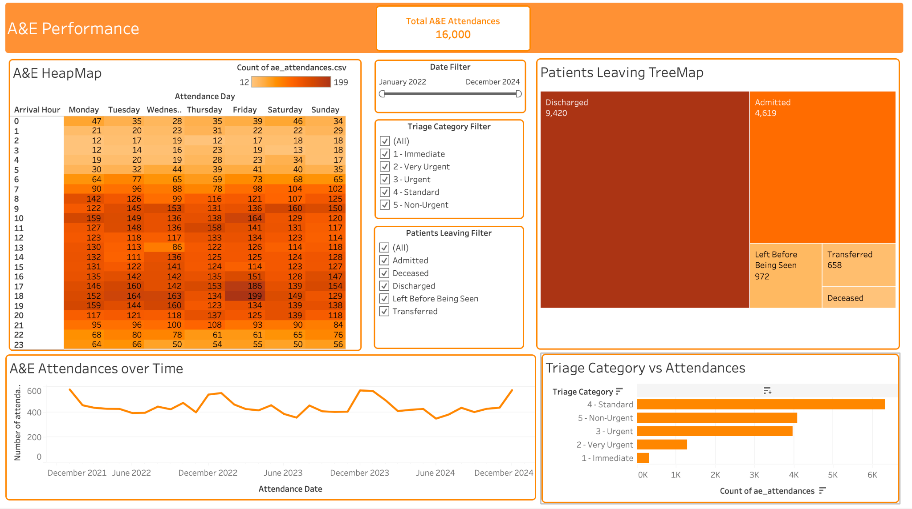

# A&E Performance Dashboard — Tableau

> MSc Data Science graduate passionate about turning raw data into actionable business insights. This project demonstrates my end-to-end analytics workflow using Tableau.

An interactive Tableau dashboard analysing **16,000 Accident & Emergency (A&E) attendances** across **2022–2024** for an NHS Trust.

The project was developed as a Tableau data analytics capstone, with the objective of transforming A&E attendance data into a clear, interactive dashboard that can support operational decision-making around demand, staffing, patient urgency and patient outcomes.



## Project Overview

A&E departments need to understand when demand is highest, what level of clinical urgency patients present with, and what happens to patients after their attendance.

This dashboard brings five key views together:

1. **A&E Attendances Over Time** — identifies changes in attendance volume and potential seasonal patterns.
2. **Total A&E Attendances** — provides the overall number of attendances as a headline KPI.
3. **Triage Category vs Attendances** — compares attendances by clinical urgency.
4. **A&E Heatmap** — shows attendance patterns by day of the week and hour of arrival.
5. **Patients Leaving TreeMap** — shows how patient attendances were disposed of, including discharged, admitted, transferred and other outcomes.

The dashboard is interactive, with filters applied across the dashboard so users can explore the data from different perspectives.

## Key Dashboard Features

- Interactive **date filter** covering January 2022 to December 2024
- Interactive **triage category filter**
- Interactive **patient outcome/disposal filter**
- Cross-filtering/interactivity across dashboard visualisations
- KPI card showing **16,000 total A&E attendances**
- Heatmap for identifying busy day/hour combinations
- Trend analysis of A&E demand over time
- Triage category comparison
- Patient outcome breakdown

## Key Findings

The dashboard provides several operational insights:

- The A&E department recorded **16,000 attendances** over the three-year period.
- Attendance volumes vary over time, with visible peaks and dips across the 2022–2024 period.
- **Standard (Category 4)** represents the largest triage category in the dashboard, followed by Non-Urgent and Urgent attendances.
- The heatmap highlights clear differences in demand by **day and arrival hour**, helping identify periods of higher operational pressure.
- **Discharged** patients represent the largest patient outcome category, followed by **Admitted** patients.
- The interactive filters allow users to investigate how these patterns change across dates, triage categories and patient outcomes.

## Business Questions

The dashboard was designed around five business questions:

| Business Question | Dashboard View |
|---|---|
| How has the number of A&E attendances changed over the three years, and is there a seasonal pattern? | A&E Attendances Over Time |
| How many A&E attendances has the hospital handled in total? | Total A&E Attendances |
| What is the mix of triage categories? | Triage Category vs Attendances |
| At what times of the week is A&E busiest? | A&E Heatmap |
| What happens to patients leaving A&E? | Patients Leaving TreeMap |

## Data

The project uses three years of A&E attendance data covering **2022–2024** and **16,000 records**.

Key fields include:

- `AE_ID` — unique identifier for each A&E attendance
- `Patient_ID` — patient identifier
- `Attendance_Date` — date of attendance
- `Attendance_Day` — day of the week
- `Arrival_Hour` — hour of arrival, from 0–23
- `Triage_Category` — clinical urgency from Category 1 (Immediate) to Category 5 (Non-Urgent)
- `Attendance_Type` — First Attendance or Follow Up
- `Disposal` — patient outcome such as Discharged, Admitted or Transferred
- `Wait_Time_Minutes` — patient waiting time
- `Within_4_Hours` — whether the patient was seen within the NHS four-hour target

## Tools & Technologies

- **Tableau** — data visualisation and interactive dashboard development
- **Data Analysis** — exploratory analysis and identification of operational patterns
- **Dashboard Design** — KPI design, filters, heatmaps, trend analysis and categorical comparison

## Dashboard Design

The dashboard was designed with a focus on clarity and usability:

- KPI positioned prominently at the top
- Trend analysis positioned for quick review of demand over time
- Heatmap used to identify high-demand periods
- Bar chart used for straightforward triage comparison
- Treemap used to communicate patient outcome distribution
- Consistent orange colour palette used throughout the dashboard
- Interactive filters allow users to explore the dashboard dynamically

## Repository Structure

```text
tableau-ae-performance-dashboard/
│
├── README.md
├── AE_Performance_Dashboard.twbx
│
└── images/
    └── ae-performance-dashboard.png
```

> If your Tableau workbook has a different filename, update the repository structure above accordingly.

## How to Use

1. Download or clone this repository.
2. Open `AE_Performance_Dashboard.twbx` in Tableau Desktop.
3. Open the dashboard.
4. Use the date, triage and patient outcome filters to explore the data.
5. Interact with the visualisations to investigate A&E demand patterns.

## Project Objective

The objective of this project was to demonstrate the ability to:

- Translate business questions into appropriate visualisations
- Analyse healthcare operational data
- Build an interactive Tableau dashboard
- Apply filters and dashboard interactivity
- Communicate insights clearly to a non-technical audience
- Design a professional, client-ready data visualisation

## Future Improvements

Potential extensions to the dashboard could include:

- KPI for average waiting time
- KPI for the percentage of patients seen within four hours
- Year-over-year attendance comparison
- Additional analysis of attendance type
- Average waiting time by triage category
- Drill-down from high-demand periods into patient outcomes
- Additional dashboard actions for deeper exploration

## Project Context

This project was completed as part of a Tableau data analytics capstone project. The original brief required five visualisations to be assembled into one professional, interactive A&E Performance dashboard, including a headline attendance figure and dashboard filters.

## Author

**Shubham Choudhary**
MSc Data Science | Data Analyst | Open to Work [LinkedIn](https://www.linkedin.com/in/shubham-choudhary-b84484200/) · [Portfolio](https://github.com/shubhamchoudry17) · [Email](mailto:shubhamchoudry17@gmail.com)


## 📄 Note

Datasets used in this project are for training purposes only and do not represent real data.
